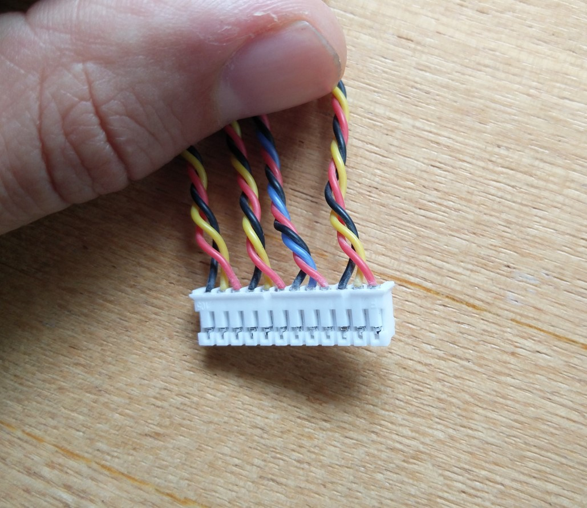

# Frsky M9 gimbal

## Wiring

These are 3.3v hall-effect joysticks. They have two sensors which are wired as:
- Red: 3.3v
- Black: 0v
- Yellow or blue: signal (between 0v and 3.3v)

These signals can be easily read using an ADC, and used to make a USB joystick or mouse.

Here's the joystick as it arrives:

The wires are all connected to this large JST connector, for installation into a Taranis RC controller:

Using a craft knife, you can lift the plastic tabs of the JST connectors, and pull the pins out. Then you can just plug the critical wires back into the 3-pin JST connectors:

The end result is much more suitable for integrating into a different project:

These are JST-PH 2.0 connectors.