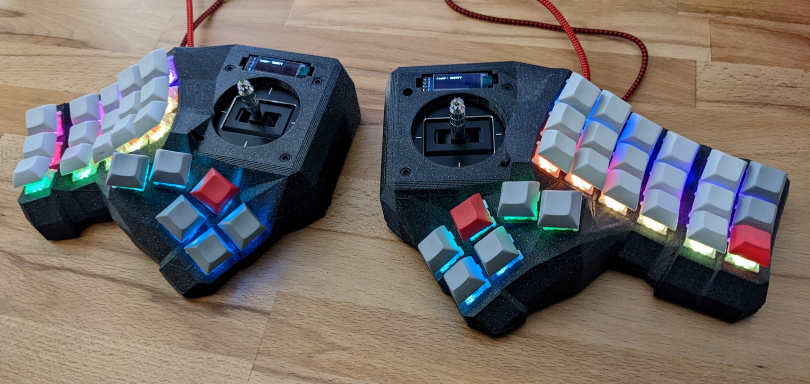
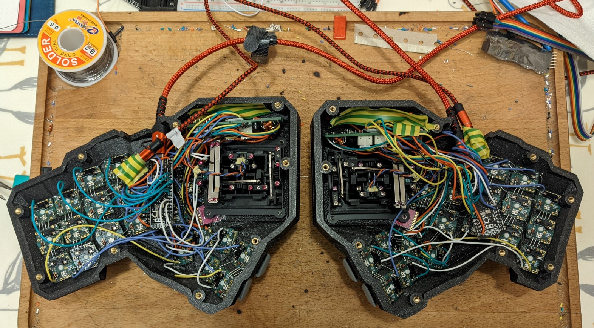
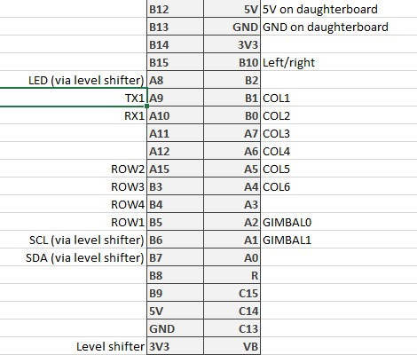
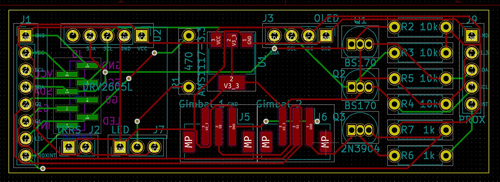
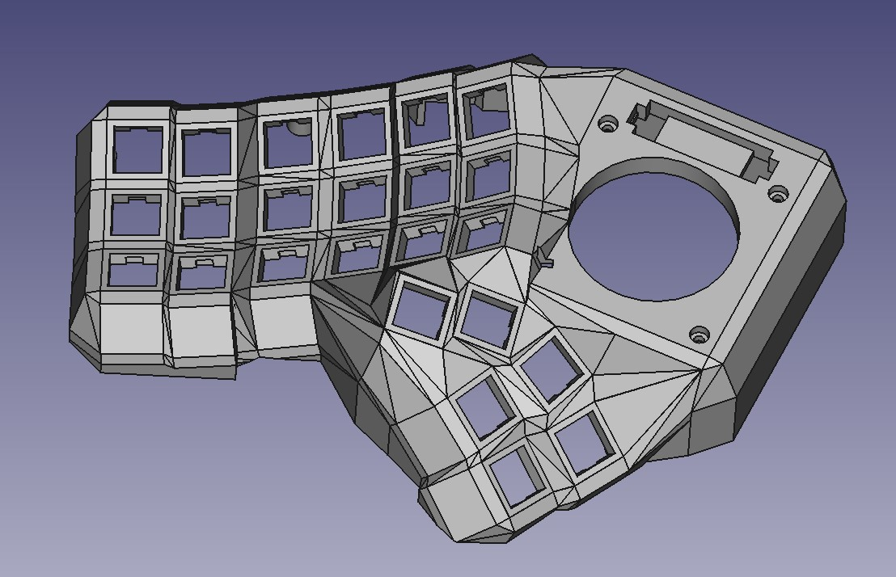

# Dactyl-Manuform-Gimbal keyboard

Why? I wanted to build something a bit different, something that I'd not seen before. I wondered what a keyboard would look like if I merged it with an RC controller, and tried using the RC gimbals as a mouse.

The result is quite fun. It's fairly space-efficient, and allows me to use the mouse with either hand. It has proximity sensors to detect when your hand is on the joystick, and turns some of the keys into mouse buttons. Haptic feedback helps to tell when you have switched layers, or long-pressed a key.

You might have noticed it has more keys on the right than the left. This is because I wanted the option to use it with [Plover](http://www.openstenoproject.org/plover/), which for a standard layout requires a minimum of 6 columns on the right, and 5 columns on the left. (I've not actually tested it with Plover, having built a [different keyboard](https://www.thingiverse.com/thing:5021950) for that in the meantime).

Fair warning: there is quite a lot of soldering involved if you want to make one:

## Components
### Keys
I picked gateron red switches and DSA keycaps, sold to me by [Mechboards](mechboards.co.uk).

### Gimbals
The twist in this design is the inclusion of a pair of joysticks. These are [Frsky M9](Frsky M9.md) RC gimbals.

### Proximity
The keyboard uses a proximity switch to detect when a hand is over the joystick, and uses this to switch the mouse buttons on. This is using an [APDS-9660](https://www.sparkfun.com/products/12787) sensor & breakout board which is glued to the underside of the case.

Here it is working:

### Controller
Originally this was designed to work with two [Pro Micro](https://www.sparkfun.com/products/12640) controllers, but these didn't really have enough flash for the QMK features I wanted.

So I used a beefier board that I was familiar with: the [Teensy 3.2](https://www.hobbytronics.co.uk/teensy-v32), which has been really good to me before. However, it turns out that QMK only sort-of supports the Teensy, so I had a lot of trouble getting it to work reliably.

In the end, I gave up, and swapped to a pair of [STM32F401CCU6 "Black pill"](https://stm32-base.org/boards/STM32F401CCU6-WeAct-Black-Pill-V1.2.html) controllers. These work flawlessly with QMK, though I did manage to kill two boards during assembly, and I'm not quite sure how.

In any case, the swap from the original 5v board to a 3.3v one meant that a level-shifter had to be added between the board and the I2C and LED lines on the breakout board.

Here's how the blackpill controller is wired:

B10 should be wired to 3V3 on the left-hand half, and to GND on the right-hand half.

Remember that TX1 on the left-hand half needs to be connected to RX1 on the right-hand half, and vice-versa.

### Haptic
I wanted to try getting some haptic feedback from the keyboard, for example when using mod-taps, or when switching to/from mouse mode. QMK has support for the [DRV2605L](https://learn.adafruit.com/adafruit-drv2605-haptic-controller-breakout) driver built in, so I used this.

I picked a linear resonant actuator to use with it, the Jinlong G0832012. Not for any highly specific reason; it was easily available and looked like roughly the right thing.

### LEDs & per-key PCBs
Per-key RGB LEDs are the cornerstone of a fancy mechanical keyboard! I had to have them. To try and keep things tidy, I used [Amoeba Royale](https://github.com/mtl/keyboard-pcbs/tree/master/amoeba-royale) per-key PCBs, printed for me by [Aisler](https://aisler.net). I got a bunch of SK6812 mini 3535 LEDs to to go with them, along with kailh hotswap sockets, and some small signal diodes.

Honestly, they were still quite painful to use. The holes in the PCB had to be filed out before the LEDs would fit in them, and the LED casings would melt if the soldering iron was on them for more than half a second. I had a couple of PCBs that were faulty also.

Here was my method for soldering them:
- Sit the LED in the hole
- Spread some flux over the back of the LED
- For each terminal
	- Put some solder on the PCB pad
	- Dag it onto the LED. Hopefully you will get a little solder bridge form
- Try once for each pad, and if it didn't work, leave it for a couple of minutes to cool before you try again.
- Repeat until all connections are made, then test the PCB.

However, once the whole lot was wired up, they do look quite tidy. The PCBs are not secured to the case, it seems to be enough just to press-fit them onto the back of the keys.

### Split communication
The two halves communicate through a TRRS connector. However, this just provides serial communications and a common ground wire - I left the 5v wire unconnected. Both of the halves need to be connected to the host computer over USB. This is for two reasons:
- Each half can send its own mouse events, which simplifies things
- I think the power draw for the whole keyboard might exceed 500ma - certainly I had some problems trying to power the whole thing from a single USB port

## Daughterboard PCB
There are a lot of connections in this keyboard: the haptic breakout board, proximity board, OLED, LED, gimbals, TRRS connection. Wiring all of these directly to the controller would be difficult.

To simplify things, I designed a PCB to hold all of these connections. It also contains a 3.3v regulator to drive the ADPS9660 board, from back when the whole system was designed to run on 5v.

Originally the SCL, SSA, and LED connections on the left were meant to go straight to pins on the pro micro controller. However, when using this with a blackpil controller, you will need to use a [level shifter](https://learn.sparkfun.com/tutorials/bi-directional-logic-level-converter-hookup-guide/all) to convert between 3.3v and 5v.

Here are the sources:
- [dactyl-manuform-gimbal.kicad_pcb](dactyl-manuform-gimbal.kicad_pcb)
- [dactyl-manuform-gimbal.pro](dactyl-manuform-gimbal.pro)
- [dactyl-manuform-gimbal.sch](dactyl-manuform-gimbal.sch)

I had mine manufactured by [Aisler](https://aisler.net/).

You will also need these parts to make up the board:
- Q3: 2N3904 TO-92
- R6 & R7: 1k resistor
- R2, R3, R4, R5: 10k resistor
- Q1 & Q2: BS170 TO-92
- R1: 470R resistor
- J5 & J6: JST_PH_B3B header

## Geometry
The geometry was generated using a fork of Joshua Shreve's dactyl-keyboard generator:

https://github.com/sffubs/dactyl-keyboard/tree/gimbal

The final files I used are here:
- [DM_left_final.step](DM_left_final.step)
- [DM_left_final.stl](DM_left_final.stl)
- [DM_left_plate_final.stp](DM_left_plate_final.stp)
- [DM_left_plate_final.stl](DM_left_plate_final.stl)
- [DM_right_final.step](DM_right_final.step)
- [DM_right_final.stl](DM_right_final.stl])
- [DM_right_plate_final.step](DM_right_plate_final.step)
- [DM_right_plate_final.stl](DM_right_plate_final.stl)
## Printing
I printed this on my Ender 3, using Prusament Galaxy Black PLA filament, with a 0.4mm nozzle at 0.2mm resolution. I used tree-style supports, which much reduced the time and plastic required.

## Firmware

The keyboard runs on QMK, and the firmware can be found here:

https://github.com/sffubs/qmk_firmware/tree/master/keyboards/handwired/dactyl_manuform_gimbal

Build using 

`qmk -kb handwired/dactyl_manuform_gimbal -km default`

